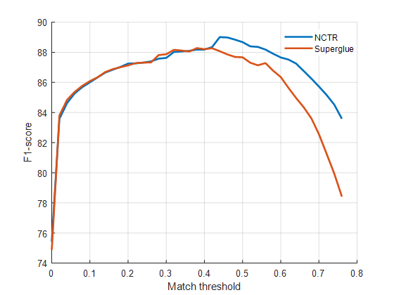
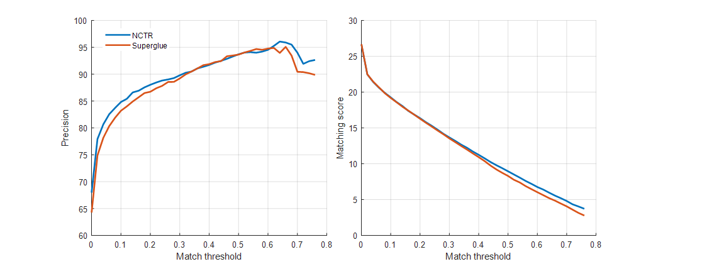

# NCTR: Neighborhood Consensus Transformer for feature matching
Repository of NCTR

Due to the space limitation of the paper, we post the appendix and some additional experiment results here.

The code will be released soon.

## Qualitative Examples

### Homography Estimation

### Outdoor Pose Estimation

## Quantitative Results

### Homography Estimation

### Outdoor Pose Estimation

